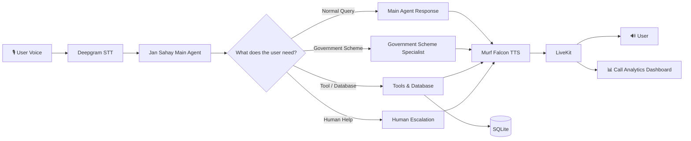

# Jan Sahay — Voice AI Agent for Government Schemes & Financial Guidance

Jan Sahay  is a voice-first AI assistant designed to help citizens access information about **government schemes, financial services, banking basics, savings, fraud prevention, and complaint helplines** through natural voice conversations.

The project was built as part of the **10 Days of Voice Agents — VoiceForBharat Edition**.

Instead of navigating multiple websites or forms, users can simply speak with Jan Sahay and ask their questions.

---

## 🎯 Problem

Many people find it difficult to understand:

- Government welfare schemes
- Scheme eligibility and required documents
- Banking and savings information
- Basic financial guidance
- Digital payment and fraud-prevention safety
- Where and how to report financial complaints

Jan Sahay aims to make this information easier to access through a simple voice-based conversation.

---

## 💡 What Jan Sahay Can Do

### 🏛️ Government Scheme Assistance

Jan Sahay can help users with:

- Government scheme information
- Eligibility-related guidance
- Required document checklists
- Benefits and application guidance
- Scheme-related questions

For more complex scheme questions, the conversation can be transferred to a dedicated **Government Scheme Specialist Agent**.

### 💰 Financial & Banking Guidance

The agent can provide general guidance related to:

- Bank accounts
- Savings
- Basic financial concepts
- Financial literacy
- Direct benefit transfer (DBT) related information

The agent is designed to avoid unsafe or misleading financial advice.

### 🛡️ Fraud Prevention

Jan Sahay can provide safety guidance related to:

- UPI collect scams
- OTP safety
- Phishing
- Suspicious financial requests
- Basic digital-payment precautions

### 📞 Complaint & Helpline Guidance

The system can guide users toward appropriate complaint and support channels when required.

### 🧠 Memory

The project includes memory functionality so that relevant information can be retained for returning users.

### 📞 Outbound Calls

Jan Sahay also includes outbound voice-call functionality for supported use cases.

### 👤 Human Escalation

When the AI cannot safely handle a situation, the system can escalate the conversation for human assistance.

### 📊 Call Analytics

The project includes a dashboard for monitoring voice-call activity, including:

- Total calls
- Successful calls
- Failed calls
- Success rate
- Average call duration
- Recent call history

The dashboard is connected to actual call data rather than hardcoded values.

### 🔄 Specialist Agent Handoff

Jan Sahay uses a main agent and a dedicated specialist agent.

For example:

```text
User asks a normal question
        ↓
Main Jan Sahay Agent
        ↓
Conversation continues normally
```

For a government scheme question:

```text
User asks about a government scheme
        ↓
Main Jan Sahay Agent
        ↓
User is informed about the handoff
        ↓
Government Scheme Specialist Agent
        ↓
Specialist continues using existing context
```

This keeps the main agent focused while allowing specialist agents to handle specific domains.

---

## 🏗️ Architecture



---

## 🔊 Voice AI Pipeline

The real-time voice pipeline works like this:

```text
User speaks
    ↓
Speech-to-Text
    ↓
Jan Sahay AI Agent
    ↓
Tools / Memory / Specialist Handoff / Human Escalation
    ↓
Murf Falcon Text-to-Speech
    ↓
LiveKit
    ↓
User hears the response
```

### Main Components

| Component | Technology | Purpose |
|---|---|---|
| Speech-to-Text | Deepgram | Converts user speech into text |
| AI Agent / LLM | Gemini | Understands requests and generates responses |
| Text-to-Speech | Murf Falcon | Generates natural voice responses |
| Real-time Transport | LiveKit | Handles real-time voice communication |
| Backend | Python | Agent logic and backend functionality |
| Frontend | Next.js | Voice interface and dashboard |
| Database | SQLite | Stores relevant application and call data |

---

## ✨ Key Features

- 🎙️ Real-time voice conversations
-  Citizen-focused government scheme assistance
- 💰 Banking and financial guidance
- 🛡️ Fraud-prevention guidance
- 🧠 User memory
- 🛠️ Tools and database integration
- 📞 Outbound voice calls
- 👤 Human escalation
- 📊 Call analytics dashboard
- 🔄 Specialist-agent handoff
- 🗣️ Natural-sounding voice using Murf Falcon
- 🔐 Safety guardrails for sensitive financial topics

---

# 🚀 Getting Started

## Prerequisites

You will need:

- Python 3.10+
- Node.js 18+
- `uv`
- `pnpm`
- A LiveKit project
- Murf API key
- Deepgram API key
- Gemini API key

---

## 1. Clone the Repository

```bash
git clone https://github.com/lipsapayal7-collab/jan-sahay-voice-ai.git
cd jan-sahay-voice-ai
```

---

## 2. Set Up Environment Variables

### Backend

Create:

```text
backend/.env.local
```

Add your own credentials:

```env
LIVEKIT_URL=your_livekit_url
LIVEKIT_API_KEY=your_livekit_api_key
LIVEKIT_API_SECRET=your_livekit_api_secret

MURF_API_KEY=your_murf_api_key
DEEPGRAM_API_KEY=your_deepgram_api_key
GOOGLE_API_KEY=your_google_api_key
```

### Important

**Never publish API keys, secrets, phone numbers, or private caller data.**

The `.env.local` file is excluded from Git using `.gitignore`.

---

## 3. Install Backend Dependencies

```bash
cd backend
uv sync
```

If the project requires the agent files to be downloaded:

```bash
uv run python src/agent.py download-files
```

---

## 4. Install Frontend Dependencies

Open another terminal:

```bash
cd frontend
pnpm install
```

---

# ▶️ Running the Project

The project can be run using three terminals.

### Terminal 1 — LiveKit Server

From the project root:

```bash
livekit-server --dev
```

### Terminal 2 — Backend Agent

```bash
cd backend
uv run python src/agent.py dev
```

### Terminal 3 — Frontend

```bash
cd frontend
pnpm dev
```

Then open:

```text
http://localhost:3000
```

Allow microphone access and start a voice conversation with Jan Sahay.

---

# 🧪 Testing the Agent

### Normal Query

Example:

```text
User: What is a savings account?
```

The request remains with the main Jan Sahay agent.

### Government Scheme Query

Example:

```text
User: I want to know about a government scheme.
```

Jan Sahay informs the user before handing the conversation to the Government Scheme Specialist.

The specialist then continues the conversation using the existing context.

### Additional Testing

During development, I also tested:

- Memory
- Outbound calls
- Human escalation
- Successful call paths
- Failed call paths
- Call analytics
- Specialist-agent handoffs

---

# 📁 Project Structure

```text
jan-sahay-voice-ai/
│
├── backend/
│   ├── src/
│   │   ├── agent.py
│   │   ├── database.py
│   │   ├── outbound_call.py
│   │   ├── prompt.py
│   │   └── specialist_agent.py
│   │
│   ├── tests/
│   │   └── test_agent.py
│   │
│   ├── update_users.py
│   ├── pyproject.toml
│   └── README.md
│
├── frontend/
│   ├── app/
│   │   └── api/
│   │       ├── token/
│   │       └── dashboard/
│   │
│   ├── components/
│   │   └── app/
│   │       └── dashboard-view.tsx
│   │
│   ├── package.json
│   └── pnpm-lock.yaml
│
├── .gitignore
├── AGENTS.md
├── LICENSE
├── README.md
├── start_app.ps1
└── start_app.sh
```

---

# 🧩 Important Backend Files

### `agent.py`

Main Jan Sahay voice agent and real-time conversation logic.

### `database.py`

Handles database-related functionality and persistent information.

### `prompt.py`

Contains the agent's instructions, personality, objectives, and safety-related behavior.

### `specialist_agent.py`

Handles government-scheme-specific conversations after a specialist handoff.

### `outbound_call.py`

Contains outbound voice-call functionality.

### `update_users.py`

Utility for updating relevant user information.

---

# 📊 Dashboard

The frontend includes a call analytics dashboard showing information such as:

```text
Total Calls
Successful Calls
Failed Calls
Success Rate
Average Call Duration
Recent Call History
```

The dashboard uses call data generated during the application's voice interactions.

---

# 🛡️ Safety

Jan Sahay is designed to provide general information and guidance rather than replace official government, banking, or financial services.

The agent should not request or expose sensitive information such as:

- Passwords
- OTPs
- API keys
- Private credentials
- Unnecessary personal financial information

Users should verify important information through official sources before taking financial or government-service actions.

---

# 🛠️ Challenges During Development

Building the complete voice agent was not always straightforward.

Some challenges I faced included:

- LiveKit session/setup issues during the early stages
- Sometimes the agent failed to join the session
- Voice conversations occasionally failed to connect correctly
- Implementing persistent memory
- Setting up outbound calls
- Implementing human escalation
- Building the call analytics dashboard
- Connecting the dashboard with actual call data
- Implementing specialist-agent handoffs while preserving conversation context

These problems helped me understand that building a real-time voice agent involves more than simply connecting an LLM to a TTS API.

---

# 📚 What I Learned

Through this project, I learned how to build a more complete voice AI system using:

- Real-time voice communication
- Speech-to-text
- LLM-based agent logic
- Text-to-speech
- Tools
- Databases
- User memory
- Outbound calling
- Human escalation
- Analytics
- Multi-agent handoffs
- Frontend integration

The project also taught me the importance of testing real voice conversations and handling failure cases instead of only testing the happy path.

---

# 🔮 Future Improvements

Some improvements I would like to explore next:

- Better support for Indian regional languages
- More government schemes and verified data sources
- Improved multilingual and code-mixed conversations
- More robust failure recovery
- Better analytics and reporting
- More specialist agents for different citizen needs
- Deployment for real-world testing
- Stronger verification against official government sources

---

# 🏆 10 Days of Voice Agents

This project was built as part of:

**10 Days of Voice Agents — VoiceForBharat Edition**

The challenge helped me build Jan Sahay step by step, from a basic voice agent to a system with memory, tools, outbound calls, human escalation, analytics, and specialist-agent handoffs.

---

# 🔗 Links

### GitHub Repository

https://github.com/lipsapayal7-collab/jan-sahay-voice-ai

### Technologies

- [Murf Falcon](https://murf.ai/api/docs)
- [LiveKit](https://docs.livekit.io)
- [Deepgram](https://developers.deepgram.com)
- [Python](https://www.python.org/)
- [Next.js](https://nextjs.org/)

---

## 🙌 Acknowledgements

A big thank you to **Murf AI** for the **10 Days of Voice Agents — VoiceForBharat Edition** challenge and for providing Murf Falcon for the voice experience.

---

## 📄 License

MIT License
