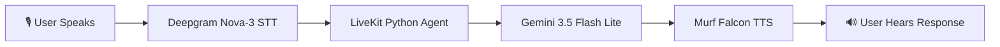
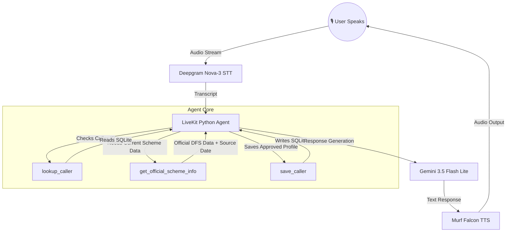

# Jan Sahay (जन सहाय) — Financial Literacy Voice Agent

Jan Sahay is an AI-powered voice assistant built for the **Financial Literacy & Services Track**.

It helps citizens understand Indian government financial schemes and promotes safe digital banking habits through natural voice interaction.

The agent supports:

- Voice-based interaction
- Live government scheme information lookup
- Function calling
- Persistent caller memory with consent
- English and Hindi/Hinglish interaction
- Safe digital banking guidance
- Graceful handling of live-data failures

---

## 🌟 Key Features

### 🧠 Persistent Memory & Consent

Jan Sahay can remember safe caller information across sessions using SQLite.

It can retain:

- Caller name
- Preferred language
- Schemes discussed
- General scheme-related discussions

The agent requires explicit user consent before saving personal information.

Jan Sahay never stores sensitive financial credentials such as:

- Aadhaar numbers
- PAN numbers
- Bank account numbers
- OTPs
- PINs
- Passwords
- Debit/credit card numbers
- UPI PINs

---

## 🔊 Voice AI Pipeline

Jan Sahay uses the following voice pipeline:



For live financial-scheme questions, the agent can additionally call the official scheme information tool before generating its response.

---

# 🚀 Day 5 — Live Domain Data & Function Calling

Day 5 upgrades Jan Sahay with a real external data source and function calling.

The agent can retrieve current financial scheme information from the official **Department of Financial Services, Ministry of Finance, Government of India** website.

## 🔧 Function Tool

### `get_official_scheme_info`

The tool is designed to retrieve official scheme information for:

- PMJDY — Pradhan Mantri Jan Dhan Yojana
- PMSBY — Pradhan Mantri Suraksha Bima Yojana
- PMJJBY — Pradhan Mantri Jeevan Jyoti Bima Yojana

The tool can retrieve information such as:

- Premium
- Eligibility
- Benefits
- Coverage

The tool is automatically called when the caller asks for:

- Current information
- Latest information
- Official information
- Eligibility
- Premium
- Benefits
- Coverage

### Example

User:

> What is the current premium and eligibility for PMSBY?

The agent identifies that current information is required and calls:

```text
get_official_scheme_info("PMSBY")
```

The returned information is then converted into a natural spoken response.

---

## 🌐 Real Data Source

Jan Sahay uses **live data from official government sources**.

The live scheme information is fetched from the:

**Department of Financial Services, Ministry of Finance, Government of India**

No hand-built local dataset is used for the Day 5 live scheme lookup.

Official sources:

- PMJDY: https://www.financialservices.gov.in/pradhan-mantri-jan-dhan-yojana-pmjdy
- PMSBY: https://financialservices.gov.in/pmsby
- PMJJBY: https://www.financialservices.gov.in/pmjjby

---

## 📅 Data Freshness

The live tool provides two timestamps:

- `source_updated` — the update date shown on the official government source
- `fetched_at` — the date and time when Jan Sahay fetched the information

This allows the agent to distinguish between:

> The date the official source was updated

and:

> The date and time the information was fetched live

The agent does not describe an older source update as today's update.

For example:

> According to the official Department of Financial Services website, this information was last updated on January 5, 2026.

---

## ⚠️ Graceful Failure Handling

External APIs and government websites may become unavailable or time out.

Jan Sahay handles this situation explicitly.

If the official source cannot be reached:

1. The tool returns a failure result.
2. The agent does not invent or guess current information.
3. The caller receives a natural spoken fallback.

Example:

> I'm sorry, but I can't verify the latest information from the official government source right now, so I don't want to give you an incorrect answer.

This prevents the agent from silently failing or hallucinating current financial information.

---

## 🗣️ Language Adaptation

Jan Sahay supports natural language adaptation.

- New calls start in English.
- If the caller speaks English, the agent continues in English.
- If the caller speaks Hindi or Hinglish, the agent can switch naturally.
- The agent mirrors the caller's language after the first turn.

---

## 🧪 Day 5 Testing

### Test 1 — Live Data

Ask the agent:

> What is the current premium and eligibility for PMSBY?

Expected behavior:

```text
SCHEME LOOKUP TOOL CALLED
SCHEME LOOKUP SUCCESS
```

The agent should provide the live scheme information naturally.

---

### Test 2 — Source Date

Ask:

> When was this information last updated?

Expected behavior:

The agent states the official source update date using the `source_updated` value returned by the live tool.

---

### Test 3 — Failure Path

Temporarily make the PMSBY source unavailable.

Ask:

> What is the current PMSBY premium?

Expected behavior:

```text
SCHEME LOOKUP TOOL CALLED
SCHEME LOOKUP NETWORK FAILURE
```

The agent should explain that current information cannot currently be verified.

It must not invent or guess the answer.

---

### Test 4 — Unclear Scheme Name

Ask something unclear, for example:

> Is the current PMA PSY?

The agent should ask for clarification instead of providing unrelated current financial information.

Example:

> I'm not sure which scheme you mean. Did you mean PMSBY — Pradhan Mantri Suraksha Bima Yojana?

After confirmation, the agent can use the live scheme information tool.

---

## 🎥 Day 5 Demo

The Day 5 demonstration covers:

- Jan Sahay starting in English
- A caller asking for current PMSBY information
- Automatic function calling
- Live government information retrieval
- Natural spoken output
- Official source update date
- Handling of an unclear scheme name
- Simulated live-data failure
- Spoken fallback without hallucinating information

A short demo video should show the tool firing on a real question and, if possible, the graceful failure behavior when the data source is unavailable.

---

# 🏗️ Architecture & Data Flow



---

# 🛠️ Technology Stack

| Component | Technology |
|---|---|
| Voice Agent Framework | LiveKit Agents |
| Programming Language | Python |
| LLM | Gemini 3.5 Flash Lite |
| Speech-to-Text | Deepgram Nova-3 |
| Text-to-Speech | Murf Falcon TTS |
| TTS Voice | Anisha |
| Database | SQLite |
| Language Detection | Transcript-based detection |
| Live Data Source | Department of Financial Services website |

---

# 🔐 Digital Banking Safety

Jan Sahay promotes safe digital banking practices.

The agent never asks callers to provide:

- Aadhaar numbers
- PAN numbers
- Bank account numbers
- Debit/credit card numbers
- OTPs
- PINs
- UPI PINs
- Passwords

If a caller starts sharing sensitive banking information, the agent warns them not to share it.

Jan Sahay does not:

- Approve financial schemes
- Guarantee scheme approval
- Track individual applications
- Access individual bank accounts
- Process applications

For account-specific or application-specific issues, callers are directed to the appropriate bank branch or official government portal.

---

# 🚀 Quickstart

## Prerequisites

- **Python 3.10+**
- **uv** — Python package manager
- **Node.js 18+**
- **pnpm** — Node package manager
- A **LiveKit** project

---

## Step 1: Clone the Repository

```bash
git clone <your-repository-url>
cd <your-repository-folder>
```

---

## Step 2: Configure Environment Variables

Create `.env.local` in both `backend/` and `frontend/`.

Required backend environment variables include:

```text
LIVEKIT_URL
LIVEKIT_API_KEY
LIVEKIT_API_SECRET
MURF_API_KEY
DEEPGRAM_API_KEY
GOOGLE_API_KEY
```

Do not commit API keys or secrets to GitHub.

---

## Step 3: Install Backend Dependencies

```bash
cd backend
uv sync
```

If required by the project:

```bash
uv run python src/agent.py download-files
```

---

## Step 4: Install Frontend Dependencies

```bash
cd frontend
pnpm install
```

---

## Step 5: Run the Application

### Option A — Windows

From the repository root:

```powershell
.\start_app.ps1
```

### Option B — macOS/Linux

```bash
chmod +x start_app.sh
./start_app.sh
```

### Option C — Run Separately

Terminal 1:

```bash
livekit-server --dev
```

Terminal 2:

```bash
cd backend
uv run python src/agent.py dev
```

Terminal 3:

```bash
cd frontend
pnpm dev
```

Then open:

```text
http://localhost:3000
```

Click **Start talking**, allow microphone access, and speak with Jan Sahay.

---

# 📁 Project Structure

```text
jan-sahay/
│
├── backend/
│   ├── src/
│   │   └── agent.py
│   ├── tests/
│   ├── .env.example
│   ├── pyproject.toml
│   ├── README.md
│   └── railway.toml
│
├── frontend/
│   ├── app/
│   │   ├── page.tsx
│   │   └── api/
│   ├── components/
│   ├── app-config.ts
│   ├── .env.example
│   ├── README.md
│   └── package.json
│
├── start_app.sh
├── start_app.ps1
├── AGENTS.md
├── LICENSE
└── README.md
```

---

# 📚 Documentation

For deeper implementation details:

- [Backend Documentation](./backend/README.md)
- [Frontend Documentation](./frontend/README.md)

The backend README contains detailed information about:

- Agent pipeline
- Persistent memory
- Consent handling
- Function calling
- Live government data
- Data freshness
- Failure handling
- Backend testing

The frontend README contains information about:

- UI customization
- Visualizers
- Theming
- Components
- Frontend architecture

---

# 🌐 Official Data Sources

Jan Sahay's live financial scheme lookup uses official Government of India sources.

### PMJDY

https://www.financialservices.gov.in/pradhan-mantri-jan-dhan-yojana-pmjdy

### PMSBY

https://financialservices.gov.in/pmsby

### PMJJBY

https://www.financialservices.gov.in/pmjjby

**Data status:** LIVE

No hand-built local dataset is used for the Day 5 live scheme lookup.

---

# 🔗 Useful Links

- [Murf API Documentation](https://murf.ai/api/docs)
- [Murf Voice Library](https://murf.ai/api/docs/voices-styles/voice-library)
- [LiveKit Documentation](https://docs.livekit.io)
- [Deepgram Documentation](https://developers.deepgram.com)
- [Gemini API Documentation](https://ai.google.dev/)
- [Department of Financial Services](https://financialservices.gov.in/)

---

# 🏆 Challenge Progress

### Day 4 — Persistent Memory & Consent

- Persistent caller memory
- SQLite database
- Caller lookup
- Consent-based information storage
- Sensitive financial information protection

### Day 5 — Live Domain Data & Function Calling

- Real government data source
- Function calling
- `get_official_scheme_info`
- Automatic tool selection
- Data freshness
- Source update date
- Fetch timestamp
- Timeout handling
- Graceful failure response
- No hallucinated current information
- Successful real-agent testing

---

# 👩‍💻 Project

**Jan Sahay (जन सहाय)**  
Financial Literacy Voice Agent

Built as part of the **10 Days Voice Agent Challenge**.

**Day 4:** Persistent Memory & Consent  
**Day 5:** Live Domain Data & Function Calling

---

# 📄 License

MIT
