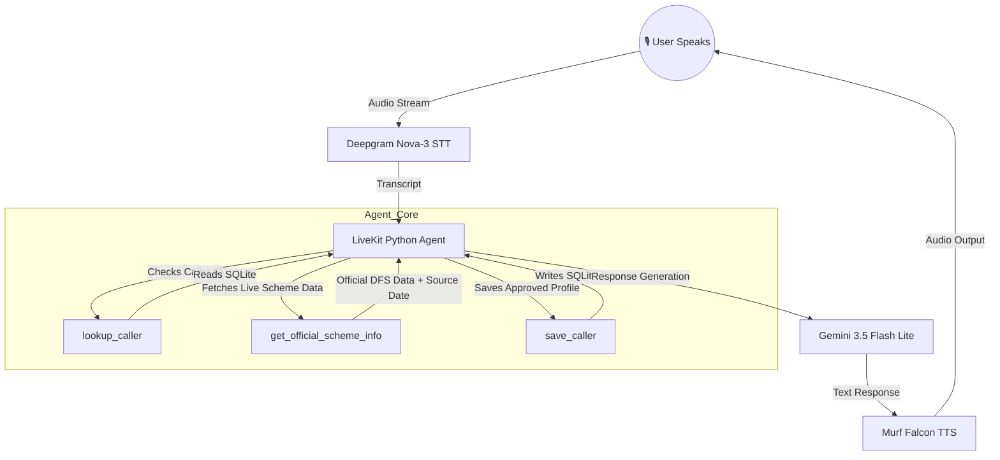

# Jan Sahay (जन सहाय) — Financial Literacy Voice Agent

Jan Sahay is an AI-powered voice assistant built for the **Financial Literacy & Services Track**.

It helps citizens understand Indian government financial schemes and promotes safe digital banking habits through natural voice interaction.

The agent supports persistent caller memory, consent-based information storage, and live government scheme information lookup.

---

## 🌟 Key Capabilities (Day 4 & Day 5 Updates)

### 1. Persistent Memory & Consent — Day 4

- Retains caller preferences, names, and scheme discussions across sessions using SQLite (`financial_users.db`).
- Uses the `lookup_caller` tool to retrieve existing caller information.
- Uses the `save_caller` tool to store approved caller information.
- Enforces explicit user consent before storing personal facts.
- Never stores sensitive financial credentials such as Aadhaar, PAN, OTP, PIN, passwords, or card details.

### 2. Real-time Domain Tool / Function Calling — Day 5

- **Tool Name:** `get_official_scheme_info`
- Fetches current official information for:
  - PMJDY — Pradhan Mantri Jan Dhan Yojana
  - PMSBY — Pradhan Mantri Suraksha Bima Yojana
  - PMJJBY — Pradhan Mantri Jeevan Jyoti Bima Yojana
- Retrieves information such as:
  - Premium
  - Eligibility criteria
  - Benefits
  - Coverage
- The tool is automatically called when the caller asks for current, latest, official, eligibility, premium, or benefit information.

### 3. Live Government Data Source

The tool fetches information directly from the official:

**Department of Financial Services, Ministry of Finance, Government of India**

The data is **LIVE**, not a hand-built local dataset.

The tool performs an HTTP request to the official government webpage when the relevant question is asked.

### 4. Data Freshness

The tool provides two important timestamps:

- **`source_updated`** — the update date shown on the official government webpage.
- **`fetched_at`** — the date and time when Jan Sahay fetched the information.

This allows the agent to distinguish between:

> "The information was updated on January 5, 2026"

and:

> "The information was fetched live just now."

The agent is instructed not to describe an older source update as "today's update".

### 5. Graceful Failure Handling

The live lookup uses a timeout to prevent the agent from waiting indefinitely for the government source.

If the official source cannot be reached:

- The tool returns a failure result.
- The agent does not invent or guess current figures.
- The caller receives a natural spoken fallback explaining that live verification is temporarily unavailable.

Example:

> "I'm sorry, but I can't verify the latest information from the official government source right now, so I don't want to give you an incorrect answer."

This provides a graceful failure path instead of silence or hallucinated information.

### 6. Language Adaptation

- Every new call starts in **English**.
- If the caller speaks English, the agent continues in English.
- If the caller speaks Hindi or Hinglish, the agent can naturally switch to Hindi/Hinglish.
- The agent mirrors the caller's language after the first turn.

### 7. Digital Banking Safety

Jan Sahay promotes safe banking practices.

The agent never asks users to provide:

- Aadhaar numbers
- PAN numbers
- Bank account numbers
- Debit/credit card numbers
- OTPs
- PINs
- Passwords
- UPI PINs

The agent also warns callers not to share sensitive banking credentials.

---

## 🏗️ Architecture & Data Flow

## 🛠️ Technology Stack

| Component | Technology |
|---|---|
| Voice Agent Framework | LiveKit Agents |
| Programming Language | Python |
| LLM | Gemini 3.5 Flash Lite |
| Speech-to-Text | Deepgram Nova-3 |
| Text-to-Speech | Murf Falcon TTS |
| TTS Voice | Anisha |
| Database | SQLite |
| Language Detection | Transcript-based detection |
| Live Data | Department of Financial Services website |

Programming Language

Python

🔧 Day 5 Function Tool

get_official_scheme_info

The tool is designed to be called automatically when the caller needs current or official scheme information.

Example user question:

"What is the current premium and eligibility for PMSBY?"

The agent determines that current information is required and calls:

get_official_scheme_info("PMSBY")

The tool then:

Identifies the requested scheme.

Connects to the official DFS webpage.

Fetches the webpage.

Extracts relevant scheme information.

Extracts the official source update date.

Records the fetch timestamp.

Returns the information to the agent.

The agent converts the result into a natural spoken response.

📊 Example Successful Interaction

User

"What is the current premium and eligibility for PMSBY?"

Tool

SCHEME LOOKUP TOOL CALLED - scheme=PMSBY
SCHEME LOOKUP SUCCESS

Agent

"For the Pradhan Mantri Suraksha Bima Yojana, the annual premium is ₹20. The eligibility is for individuals between 18 and 70 years of age with a savings bank account. It provides accidental death and disability cover."

📅 Data Freshness Example

The caller can ask:

"When was this information last updated?"

Jan Sahay uses the source_updated value returned by the live tool.

Example response:

"According to the official Department of Financial Services website, this information was last updated on January 5, 2026."

⚠️ Failure Handling

If the official government source becomes unavailable, the tool catches the network failure.

Example terminal output:

SCHEME LOOKUP TOOL CALLED - scheme=PMSBY
SCHEME LOOKUP NETWORK FAILURE

The agent should respond naturally:

"I'm sorry, but I can't verify the latest information from the official government source right now, so I don't want to give you an incorrect answer."

The agent must not invent a current premium, eligibility requirement, benefit, or coverage amount.

🗣️ Scheme Name Recovery

If speech recognition produces an unclear scheme name, Jan Sahay can use a recovery response.

For example:

User

"Is the current PMPSY?"

Agent

"I apologize, but our scheme registry is currently undergoing maintenance. However, generally for basic financial schemes, you will need standard ID proofs like a Voter ID or Driving License. Did you mean PMSBY?"

If the caller confirms:

"Yes."

Jan Sahay can identify PMSBY and use the live scheme information tool before giving current PMSBY information.

🧠 Persistent Memory

Jan Sahay uses SQLite to maintain safe caller information across sessions.

The memory system can retain:

Caller name

Preferred language

Schemes discussed

General eligibility answers

The agent must receive explicit permission before saving information.

Example:

"I can remember your name, preferred language, and the scheme we discussed for your next call. Is it okay if I save this information?"

Only after a clear confirmation does the agent call:

save_caller

🔐 Privacy & Safety

Jan Sahay follows strict privacy rules.

The agent must never request or store:

Aadhaar Number
PAN Number
Bank Account Number
Debit/Credit Card Number
OTP
PIN
UPI PIN
Password

If a caller begins sharing sensitive banking information, the agent warns them to stop.

Jan Sahay also does not:

Approve financial schemes

Guarantee scheme approval

Track individual applications

Access individual bank accounts

Process applications

For account-specific or application-specific issues, the caller is directed to the appropriate bank branch or official government portal.

🚀 How to Run

Install dependencies:

uv sync

Start the development agent:

uv run python src/agent.py dev

For console testing:

uv run python src/agent.py console

Make sure the required environment variables are configured in:

.env.local

🧪 Day 5 Testing Checklist

Test 1 — Live Data

Ask:

"What is the current premium and eligibility for PMSBY?"

Expected:

SCHEME LOOKUP TOOL CALLED
SCHEME LOOKUP SUCCESS

The agent should provide the live information naturally.

Test 2 — Source Date

Ask:

"When was this information last updated?"

Expected:

The agent states the official source update date.

Test 3 — Failure Path

Temporarily make the PMSBY source unavailable.

Ask:

"What is the current PMSBY premium?"

Expected:

SCHEME LOOKUP TOOL CALLED
SCHEME LOOKUP NETWORK FAILURE

The agent should explain that current information cannot be verified.

It must not invent or guess the answer.

🎥 Day 5 Demo

The Day 5 video demonstrates:

Jan Sahay starting in English.

A caller asking for current PMSBY information.

Automatic function calling.

Live information being retrieved from the official government source.

Natural spoken output.

The official source update date being stated.

An unclear scheme name being handled gracefully.

A simulated live-data failure.

A spoken fallback without hallucinating information.

🌐 Official Data Sources

The live scheme information is fetched from the official Department of Financial Services website:

PMJDY:https://www.financialservices.gov.in/pradhan-mantri-jan-dhan-yojana-pmjdy

PMSBY:https://financialservices.gov.in/pmsby

PMJJBY:https://www.financialservices.gov.in/pmjjby

Data status: LIVE

No hand-built local dataset is used for the Day 5 live scheme lookup.

📁 Project Structure

jan-sahay/
│
├── agent.py
├── prompt.py
├── database.py
├── financial_users.db
├── README.md
├── .env.local

✅ Day 5 Completion Checklist

Real domain data source connected
Function tool implemented
Tool automatically called for current scheme information
Natural spoken response
Source update date available
Fetch timestamp available
Network timeout/failure handling
No hallucinated current information on tool failure
Live/local data status documented
Persistent memory from Day 4 retained
Consent-based memory saving retained

🎯 Day 5 Summary

Day 5 upgrades Jan Sahay from an agent that can remember caller information into an agent that can also retrieve live domain information from an external official source.

The agent can:

Listen → Understand → Decide to call a tool → Fetch live government data → Check freshness → Speak naturally

If the external source fails, Jan Sahay does not invent an answer. Instead, it provides a clear spoken fallback and asks the caller to try again later.

👩‍💻 Project

Jan Sahay — Financial Literacy Voice Agent

Built as part of the 10 Days Voice Agent Challenge.

**Day 4:** Persistent Memory & Consent  
**Day 5:** Live Domain Data & Function Calling

